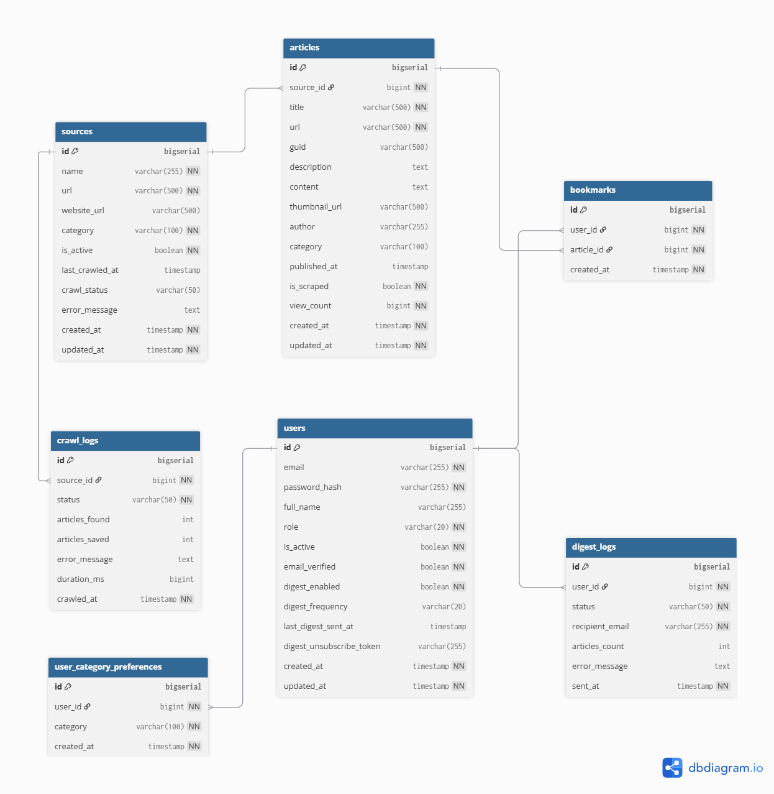
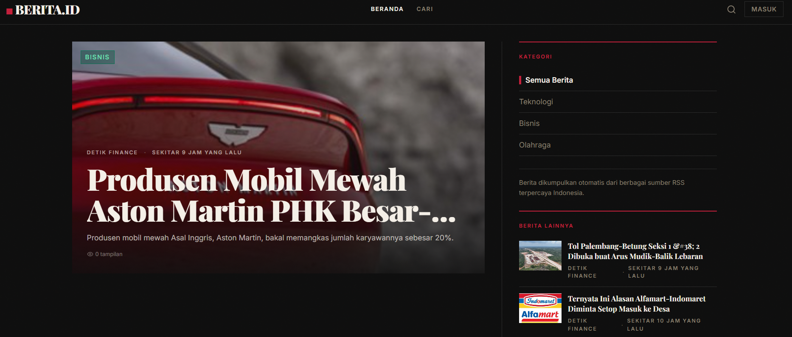
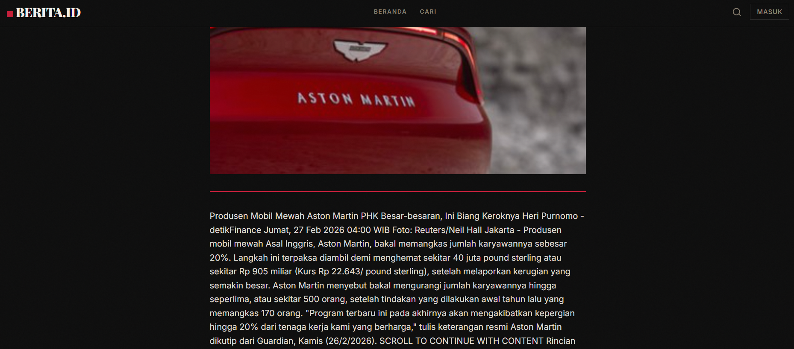
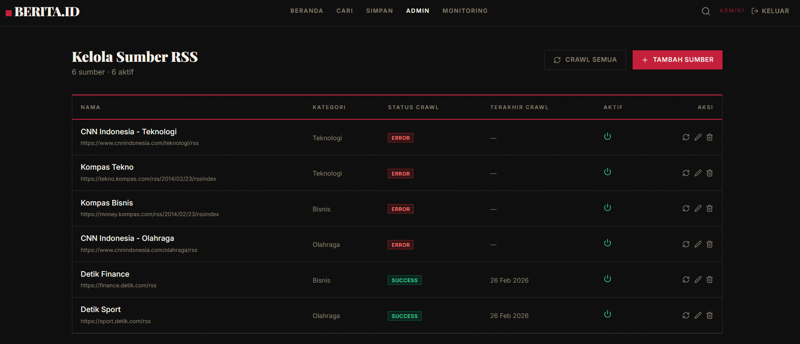
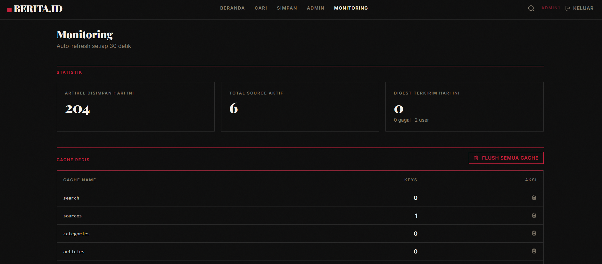

# BERITA.ID — Indonesian News Aggregator

> A full-stack news aggregation platform that automatically crawls Indonesian news sources via RSS feeds, delivers personalized email digests, and presents articles through a modern editorial-style web interface.

**Live Demo:** `[https://green-sand-00dc74200.1.azurestaticapps.net](https://green-sand-00dc74200.1.azurestaticapps.net/)
**API Docs (Swagger):** `[https://news-aggregator-id-api.azurewebsites.net/swagger-ui/index.html](https://news-aggregator-id-api.azurewebsites.net/swagger-ui/index.html)

---

## Table of Contents

1. [Project Overview](#project-overview)
2. [Architecture](#architecture)
3. [Database Design](#database-design)
4. [Business Features](#business-features)
5. [Technical Deep-Dive](#technical-deep-dive)
   - [RSS Crawler Pipeline](#rss-crawler-pipeline)
   - [Why a Message Broker?](#why-a-message-broker)
   - [Why Redis Cache?](#why-redis-cache)
   - [Email Digest System](#email-digest-system)
   - [JWT Authentication & RBAC](#jwt-authentication--rbac)
6. [Tech Stack](#tech-stack)
7. [API Reference](#api-reference)
8. [Local Development Setup](#local-development-setup)
9. [Admin Access](#admin-access)
10. [Deployment](#deployment)
11. [Screenshots](#screenshots)
12. [Project Structure](#project-structure)

---

## Project Overview

BERITA.ID aggregates news from major Indonesian media sources (CNN Indonesia, Kompas, Detik, etc.) by periodically crawling their RSS feeds. Users can browse articles by category, search across all sources, save bookmarks, and subscribe to personalized email digests.

**The problem it solves:** Indonesian news is scattered across dozens of sites. BERITA.ID brings everything into one place, filters by user-selected categories, and delivers a curated daily/weekly digest — removing the need to manually visit multiple news sites.

### Core User Journey

```
[RSS Sources] ──crawl every 15 min──▶ [Backend] ──store──▶ [PostgreSQL]
                                           │                      │
                                     [RabbitMQ]              [Redis Cache]
                                           │                      │
                                    [Scrape Worker]         [Fast API reads]
                                           │
                                   [Email Digest]──▶ [User's Inbox]
                                           │
                                     [Frontend]──▶ [User browses & bookmarks]
```

---

## Architecture

```
┌─────────────────────────────────────────────────────────────────────┐
│                        CLIENT (Browser)                             │
│         React 18 + TypeScript + Vite + TanStack Query              │
│              Azure Static Web Apps (CDN-distributed)               │
└───────────────────────────────┬─────────────────────────────────────┘
                                │ HTTPS / REST API
┌───────────────────────────────▼─────────────────────────────────────┐
│                  BACKEND (Spring Boot 3.5 / Java 21)                │
│                     Azure App Service B1 (Linux)                    │
│                                                                     │
│  ┌──────────────┐  ┌───────────────┐  ┌──────────────────────────┐ │
│  │  REST API    │  │  Crawler       │  │  Workers (Consumers)     │ │
│  │  Controllers │  │  Scheduler     │  │  - CrawlConsumer         │ │
│  │  + JWT Auth  │  │  (every 15min) │  │  - ScrapeConsumer        │ │
│  └──────┬───────┘  └───────┬────────┘  │  - DigestConsumer        │ │
│         │                  │           └──────────────────────────┘ │
└─────────┼──────────────────┼────────────────────────────────────────┘
          │                  │
    ┌─────▼──────┐    ┌──────▼───────────────────────────────────────┐
    │  Redis     │    │              RabbitMQ                        │
    │  Cache     │    │  Exchange: newsagg.exchange (Direct)         │
    │  (5 min    │    │  ├── crawl.rss.queue      (crawl tasks)     │
    │   TTL)     │    │  ├── scrape.article.queue (scrape tasks)    │
    └─────┬──────┘    │  └── email.digest.queue   (digest tasks)    │
          │           │                                              │
          │           │  dead.letter.queue (failed messages)        │
          │           └──────────────────────────────────────────────┘
          │
    ┌─────▼──────────────────────┐
    │  PostgreSQL                │
    │  Azure DB Flexible Server  │
    │  (Flyway migrations)       │
    └────────────────────────────┘
```

---

## Database Design

### Schema Diagram




### Schema Definition

```
Table sources {
  id           bigserial    [pk]
  name         varchar(255) [not null]
  url          varchar(500) [not null, unique, note: "RSS feed URL"]
  website_url  varchar(500)
  category     varchar(100) [not null]
  is_active    boolean      [not null, default: true]
  last_crawled_at timestamp
  crawl_status varchar(50)  [note: "PENDING | SUCCESS | ERROR"]
  error_message text
  created_at   timestamp    [not null, default: `now()`]
  updated_at   timestamp    [not null, default: `now()`]
}

Table articles {
  id            bigserial    [pk]
  source_id     bigint       [not null, ref: > sources.id]
  title         varchar(500) [not null]
  url           varchar(500) [not null, unique]
  guid          varchar(500) [note: "RSS GUID for deduplication"]
  description   text
  content       text         [note: "Full content after scraping"]
  thumbnail_url varchar(500)
  author        varchar(255)
  category      varchar(100)
  published_at  timestamp
  is_scraped    boolean      [not null, default: false]
  view_count    bigint       [not null, default: 0]
  created_at    timestamp    [not null, default: `now()`]
  updated_at    timestamp    [not null, default: `now()`]
}

Table users {
  id                       bigserial    [pk]
  email                    varchar(255) [not null, unique]
  password_hash            varchar(255) [not null, note: "BCrypt"]
  full_name                varchar(255)
  role                     varchar(20)  [not null, default: 'USER', note: "USER | ADMIN"]
  is_active                boolean      [not null, default: true]
  email_verified           boolean      [not null, default: false]
  digest_enabled           boolean      [not null, default: false]
  digest_frequency         varchar(20)  [note: "DAILY | WEEKLY"]
  last_digest_sent_at      timestamp
  digest_unsubscribe_token varchar(255) [unique]
  created_at               timestamp    [not null, default: `now()`]
  updated_at               timestamp    [not null, default: `now()`]
}

Table user_category_preferences {
  id         bigserial    [pk]
  user_id    bigint       [not null, ref: > users.id]
  category   varchar(100) [not null]
  created_at timestamp    [not null, default: `now()`]

  indexes {
    (user_id, category) [unique]
  }
}

Table bookmarks {
  id         bigserial [pk]
  user_id    bigint    [not null, ref: > users.id]
  article_id bigint    [not null, ref: > articles.id]
  created_at timestamp [not null, default: `now()`]

  indexes {
    (user_id, article_id) [unique]
  }
}

Table crawl_logs {
  id             bigserial   [pk]
  source_id      bigint      [not null, ref: > sources.id]
  status         varchar(50) [not null, note: "SUCCESS | FAILED"]
  articles_found int         [default: 0]
  articles_saved int         [default: 0]
  error_message  text
  duration_ms    bigint
  crawled_at     timestamp   [not null, default: `now()`]
}

Table digest_logs {
  id              bigserial    [pk]
  user_id         bigint       [not null, ref: > users.id]
  status          varchar(50)  [not null, note: "SENT | FAILED | SKIPPED"]
  recipient_email varchar(255) [not null]
  articles_count  int          [default: 0]
  error_message   text
  sent_at         timestamp    [not null, default: `now()`]
}
```

---

## Features

### For Readers (Public)
| Feature | Description |
|---------|-------------|
| **Article Feed** | Browse latest news from all sources, sorted by publish date |
| **Category Filter** | Filter by category: teknologi, bisnis, olahraga, politik, etc. |
| **Full-text Search** | Search across all article titles and descriptions |
| **Article Detail** | View full scraped content (when available) or redirect to original source |
| **View Count** | Each article detail view is automatically counted |

### For Registered Users
| Feature | Description |
|---------|-------------|
| **Bookmarks** | Save articles to a personal reading list |
| **Category Preferences** | Select favorite categories during registration |
| **Email Digest** | Receive curated top articles by email (daily at 7AM or weekly on Monday) |
| **Unsubscribe** | One-click unsubscribe link included in every digest email |

### For Admins
| Feature | Description |
|---------|-------------|
| **Source Management** | Add, edit, toggle, and delete RSS sources via web UI |
| **Manual Crawl** | Trigger crawl for a single source or all sources on demand |
| **Cache Management** | View cache keys and evict stale cache per-namespace or all at once |
| **Monitoring Dashboard** | Live stats: articles saved today, active sources, digest emails sent |
| **Crawl Logs** | Per-source crawl history with status, article counts, and duration |

---

## Technical Deep-Dive

### RSS Crawler Pipeline

The crawling system uses a **multi-stage asynchronous pipeline** powered by RabbitMQ:

```
[Scheduler: every 15 min]
         │
         ▼
CrawlerService.crawlAllActiveSources()
         │  publishes List<sourceId> to
         ▼
  crawl.rss.queue
         │
         ▼
  CrawlConsumer (Worker)
         │  for each sourceId:
         │  1. HTTP GET the RSS feed URL
         │  2. Parse XML with the Rome RSS library
         │  3. Map RSS items → Article entities
         │  4. Deduplication check:
         │     - skip if articles.url already exists in DB
         │     - also check articles.guid (RSS unique identifier)
         │  5. Batch-save new articles to PostgreSQL
         │  6. For each saved article → publish to scrape.article.queue
         │  7. Update sources.crawl_status = SUCCESS / ERROR
         │  8. Write entry to crawl_logs table
         ▼
  scrape.article.queue
         │
         ▼
  ScrapeConsumer (Worker)
         │  for each article:
         │  1. HTTP GET the original article page URL
         │  2. Parse HTML with Jsoup
         │  3. Extract main text content
         │  4. Save to articles.content
         │  5. Set articles.is_scraped = true
```

**Deduplication strategy:** Each article is checked against both `url` (canonical page link) and `guid` (RSS-specific unique identifier). This prevents duplicates even when sources republish articles under slightly different URLs.

**Dead Letter Queue:** If a message fails after all retry attempts, it routes to `dead.letter.queue` for inspection. This prevents a "poison message" from blocking the queue indefinitely.

**TTL per queue:**
- `crawl.rss.queue` and `scrape.article.queue`: 1 hour TTL
- `email.digest.queue`: 30 minutes TTL (stale digest is useless)

---

### Why a Message Broker?

**Problem without a message broker:**

If the crawler called `scrapeArticle()` synchronously inside the crawl loop, a single slow news website (e.g., 5 seconds to respond) would block the entire cycle. Crawling 20 sources × 5 seconds = 100 seconds per run. With a 15-minute crawl interval, cycles would frequently overlap and cause thread pool exhaustion.

**Solution with RabbitMQ:**

Each unit of work — crawl one source, scrape one article, send one digest email — becomes an independent message in a dedicated queue. Multiple consumer workers pull tasks concurrently (with `prefetchCount=1`, so each worker finishes one task before taking another). This means:

- Crawling 20 sources happens in **parallel**, not sequentially
- A slow scrape target only blocks **one** worker thread, not the whole system
- If the email service goes down, messages stay safely in the queue and are processed on recovery
- Sending 1,000 digest emails doesn't time out the API — it enqueues instantly and workers process async

| Concern | Without MQ | With RabbitMQ |
|---------|-----------|---------------|
| Crawl 20 sources | Sequential, ~100s | Parallel, ~5–10s |
| Slow news sites | Blocks entire cycle | Isolates to one worker |
| Email to 1,000 users | API request times out | Enqueued in ms, processed async |
| Service recovery | Lost work | Messages persist, resume on restart |

---

### Why Redis Cache?

**Problem without cache:**

`GET /api/v1/articles` is the hottest endpoint — called on every page load, category switch, and pagination click. Without caching, each request runs a `SELECT` with `JOIN`, `WHERE`, `ORDER BY`, and `LIMIT/OFFSET` against PostgreSQL. Under moderate traffic, this creates unnecessary database load for data that barely changes between requests.

**Solution with Redis:**

Spring Cache with Redis stores query results for **5 minutes** — matching the RSS crawl interval. This means:

- The vast majority of article list requests are served from in-memory Redis in under 1ms instead of running a 50–200ms database query
- PostgreSQL only handles writes (new articles from crawl) and cache-miss reads
- When a crawl saves new articles, `@CacheEvict` is triggered explicitly, so the next request fetches fresh data

**What is cached:**

| Cache Key | Content | TTL | Evicted When |
|-----------|---------|-----|--------------|
| `articles::*` | Paginated article list | 5 min | Crawl saves new articles |
| `sources::all` | Full sources list | 10 min | Source created / updated / crawled |
| `sources::categories` | Category name list | 10 min | Source created / deleted |
| `articles::detail::{id}` | Single article + full content | 5 min | Manual evict-all |

**Why not a longer TTL?**
News is time-sensitive. A 5-minute delay between publication and appearance on the site is acceptable. Longer TTL risks stale content; shorter TTL reduces the cache hit ratio and negates the benefit.

---

### Email Digest System

The digest system runs on a **cron-triggered, queue-backed** pipeline:

```
[Cron: 0 0 7 * * *  (every day at 7AM)]
         │
         ▼
DigestScheduler
  → query all users where digest_enabled = true
  → publish each userId to email.digest.queue
         │
         ▼
DigestConsumer (Worker)
  → DigestService.sendDigestToUser(userId)
         │
         ▼
  1. isDueForDigest() check:
     - DAILY:  lastDigestSentAt < 23 hours ago
     - WEEKLY: lastDigestSentAt < 6 days ago
     → prevents duplicate sends on scheduler restart
  2. Fetch top 3 articles per preferred category
     (sorted by view_count, published in last 24h)
  3. Group articles by category into Map<String, List<Article>>
  4. Render HTML email via Thymeleaf template
     (includes article titles, descriptions, thumbnails, unsubscribe link)
  5. Send via JavaMailSender (SMTP / Gmail)
  6. Update user.lastDigestSentAt = now()
  7. Write digest_log entry (SENT / FAILED / SKIPPED)
```

The `isDueForDigest()` guard on each worker ensures users never receive duplicate emails even if the scheduler fires multiple times (e.g., application restart during processing).

---

### JWT Authentication & RBAC

Authentication uses **stateless JWT** with Spring Security 6:

```
POST /api/v1/auth/login
  → validate email + BCrypt password
  → generate JWT (HS256 algorithm, 24h expiry, subject = userId)
  → return { token, userId, email, role, ... }

Every subsequent authenticated request:
  Authorization: Bearer <token>
  → JwtAuthFilter (OncePerRequestFilter) intercepts
  → validates token signature & expiry
  → loads User from DB, reads User.role
  → creates UsernamePasswordAuthenticationToken with ROLE_USER / ROLE_ADMIN
  → SecurityContext holds identity for the duration of the request
```

**Route-level protection in Spring Security:**

```java
// public
GET  /api/v1/articles/**          permitAll
GET  /api/v1/sources/categories   permitAll
POST /api/v1/auth/**              permitAll

// ADMIN only
     /api/v1/sources/**           hasRole("ADMIN")
     /api/v1/crawler/**           hasRole("ADMIN")
     /api/v1/cache/**             hasRole("ADMIN")
     /api/v1/digest/**            hasRole("ADMIN")

// any authenticated user
     /api/v1/users/**             authenticated
     /api/v1/bookmarks/**         authenticated
```

**Frontend route guard (React):**

```tsx
// AdminGuard wraps /admin and /monitoring routes
// → redirects to /login if no token
// → redirects to / if role !== 'ADMIN'
<Route element={<AdminGuard />}>
  <Route path="admin" element={<AdminPage />} />
  <Route path="monitoring" element={<MonitoringPage />} />
</Route>
```

---

## Tech Stack

### Backend
| Technology | Version | Purpose |
|-----------|---------|---------|
| Java | 21 (LTS) | Language |
| Spring Boot | 3.5.11 | Application framework |
| Spring Security | 6.x | JWT authentication & RBAC |
| Spring Data JPA + Hibernate | 6.x | ORM / database layer |
| Spring AMQP | 3.x | RabbitMQ integration |
| Spring Cache + Redis | 3.x | Distributed caching |
| Spring Mail | 3.x | SMTP email sending |
| Flyway | 10.x | Versioned database migrations |
| JJWT | 0.12.6 | JWT token generation & validation |
| Thymeleaf | 3.x | HTML email templating |
| Rome | 2.x | RSS / Atom feed parsing |
| Jsoup | 1.x | HTML scraping & content extraction |
| Lombok | 1.18.x | Boilerplate reduction |
| SpringDoc OpenAPI | 2.x | Swagger UI & API docs generation |
| PostgreSQL | 16 | Primary relational database |
| Redis | 7 | In-memory cache store |
| RabbitMQ | 3 | Message broker |

### Frontend
| Technology | Version | Purpose |
|-----------|---------|---------|
| React | 18 | UI library |
| TypeScript | 5 | Type safety |
| Vite | 6 | Build tool & dev server |
| Tailwind CSS | 3 | Utility-first styling (custom dark editorial design) |
| React Router | 6 | Client-side routing with nested layout routes |
| TanStack Query | 5 | Server state management, caching & background refetch |
| Zustand | 5 | Client state (auth token, UI state) with localStorage persistence |
| Axios | 1.x | HTTP client with request/response interceptors |
| Lucide React | — | Icon library |
| React Hot Toast | — | Toast notifications |
| date-fns | 4 | Date formatting (Indonesian locale) |

### Infrastructure (Azure — Indonesia Central)
| Service | Tier | Purpose |
|---------|------|---------|
| Azure Static Web Apps | Free | Frontend CDN hosting |
| Azure App Service | B1 Linux | Backend JAR hosting |
| Azure Database for PostgreSQL Flexible Server | Burstable B1ms | Primary database |
| Azure Cache for Redis | C0 Basic | Distributed cache |
| Azure Container Instance | 0.5 vCPU / 1 GB | RabbitMQ broker |

---

## API Reference

Full interactive documentation available at:
**`[https://https://news-aggregator-id-api.azurewebsites.net/swagger-ui/index.html](https://news-aggregator-id-api.azurewebsites.net/swagger-ui/index.html)**

### Endpoint Summary

| Method | Endpoint | Auth | Description |
|--------|----------|------|-------------|
| `POST` | `/api/v1/auth/register` | Public | Register new user |
| `POST` | `/api/v1/auth/login` | Public | Login, returns JWT |
| `GET` | `/api/v1/articles` | Public | Paginated article list (filter by category, search, sourceId) |
| `GET` | `/api/v1/articles/{id}` | Public | Article detail (auto-increments view count) |
| `GET` | `/api/v1/sources/categories` | Public | All category names |
| `GET` | `/api/v1/sources` | Admin | All RSS sources |
| `POST` | `/api/v1/sources` | Admin | Add RSS source |
| `PUT` | `/api/v1/sources/{id}` | Admin | Update source |
| `PATCH` | `/api/v1/sources/{id}/toggle` | Admin | Toggle active/inactive |
| `DELETE` | `/api/v1/sources/{id}` | Admin | Delete source |
| `POST` | `/api/v1/crawler/crawl-all` | Admin | Enqueue crawl for all active sources |
| `POST` | `/api/v1/crawler/crawl/{sourceId}` | Admin | Crawl one source (synchronous, returns result) |
| `GET` | `/api/v1/crawler/stats` | Admin | Articles saved today, active source count |
| `GET` | `/api/v1/cache/stats` | Admin | Cache key counts per namespace |
| `DELETE` | `/api/v1/cache/articles` | Admin | Evict article cache |
| `DELETE` | `/api/v1/cache` | Admin | Evict all caches |
| `GET` | `/api/v1/digest/stats` | Admin | Digest email statistics |
| `POST` | `/api/v1/digest/trigger-all` | Admin | Queue digest for all eligible users |
| `GET` | `/api/v1/users/me` | User | Own profile |
| `PUT` | `/api/v1/users/me/preferences` | User | Update category & digest preferences |
| `GET` | `/api/v1/bookmarks` | User | Bookmarked articles |
| `POST` | `/api/v1/bookmarks/{articleId}` | User | Add bookmark |
| `DELETE` | `/api/v1/bookmarks/{articleId}` | User | Remove bookmark |

---

## Local Development Setup

### Prerequisites

- Java 21 (Microsoft or Eclipse Adoptium JDK)
- Docker Desktop
- Node.js 20+

### 1. Start infrastructure

```bash
# docker-compose.yml at project root
docker-compose up -d
```

```yaml
# docker-compose.yml
version: '3.8'
services:
  postgres:
    image: postgres:16
    environment:
      POSTGRES_DB: newsagg
      POSTGRES_USER: postgres
      POSTGRES_PASSWORD: password
    ports:
      - "5433:5432"

  redis:
    image: redis:7-alpine
    ports:
      - "6379:6379"

  rabbitmq:
    image: rabbitmq:3-management
    environment:
      RABBITMQ_DEFAULT_USER: guest
      RABBITMQ_DEFAULT_PASS: guest
    ports:
      - "5672:5672"
      - "15672:15672"
```

### 2. Run the backend

```bash
cd backend

export SPRING_DATASOURCE_URL="jdbc:postgresql://127.0.0.1:5433/newsagg"
export SPRING_DATASOURCE_USERNAME="postgres"
export SPRING_DATASOURCE_PASSWORD="password"
export SPRING_REDIS_HOST="localhost"
export SPRING_REDIS_PASSWORD=""
export SPRING_RABBITMQ_HOST="localhost"
export SPRING_RABBITMQ_USERNAME="guest"
export SPRING_RABBITMQ_PASSWORD="guest"
export APP_JWT_SECRET="local-dev-secret-key-at-least-32-characters-long"

JAVA_HOME="/c/Program Files/Microsoft/jdk-21.0.9.10-hotspot" ./mvnw spring-boot:run
```

Flyway runs automatically on startup — all tables are created from `db/migration/`.

### 3. Run the frontend

```bash
cd frontend
npm install
npm run dev
# → http://localhost:5173
```

### 4. Promote a user to admin

After registering via `/daftar`, run:

```sql
UPDATE users SET role = 'ADMIN' WHERE email = 'your@email.com';
```

---

## Admin Access

### Live Site

**URL:** `[https://green-sand-00dc74200.1.azurestaticapps.net](https://green-sand-00dc74200.1.azurestaticapps.net/)

To access the **Admin** (`/admin`) and **Monitoring** (`/monitoring`) pages, your account must have the `ADMIN` role. Contact the system owner or update the database directly:

```sql
UPDATE users SET role = 'ADMIN' WHERE email = 'your@email.com';
```

### Demo Account

**Email:** `admin1@gmail.com`
**Password:** `Admin1234!`

> The Admin panel lets you manage RSS sources, trigger manual crawls, and view real-time monitoring stats. The Monitoring panel shows digest stats, cache key counts, and crawl statistics.

---

## Deployment

Deployed on **Microsoft Azure (Indonesia Central region)**.

| Component | Service | Region |
|-----------|---------|--------|
| Frontend | Azure Static Web Apps | Global CDN |
| Backend API | Azure App Service B1 (Linux, Java 21) | Indonesia Central |
| Database | Azure DB for PostgreSQL Flexible Server | Indonesia Central |
| Cache | Azure Cache for Redis C0 | Indonesia Central |
| Message Broker | Azure Container Instance (RabbitMQ) | Indonesia Central |

### Deploy backend

```bash
cd backend
JAVA_HOME="/c/Program Files/Microsoft/jdk-21.0.9.10-hotspot" ./mvnw clean package -DskipTests

az webapp deploy \
  --resource-group news-aggregator-rg \
  --name <app-service-name> \
  --src-path target/news-aggregator-*.jar \
  --type jar
```

### Deploy frontend

```bash
cd frontend
npm run build
swa deploy dist --app-name <static-app-name>
```

---

## Screenshots

<!-- TODO: Add screenshots of the application -->
<!-- Recommended:
  1. Homepage — article feed with category sidebar
  2. Article detail — full scraped content
  3. Search results
  4. Admin panel — sources table with crawl controls
  5. Monitoring dashboard
  6. Login / Register page
  7. Bookmark page
  8. Sample email digest
-->

| View | Screenshot |
|------|-----------|
| Homepage |  |
| Article Detail |  |
| Admin Panel |  |
| Monitoring |  |


---

## Project Structure

```
news-aggregator-id/
├── backend/
│   └── src/main/
│       ├── java/com/app/news_aggregator/
│       │   ├── config/          # Spring Security, Redis, RabbitMQ, JWT, CORS, OpenAPI
│       │   ├── controller/      # REST endpoints (Auth, Articles, Sources, Crawler, Cache, Digest, Bookmarks, Users)
│       │   ├── crawler/         # RssFeedParser (Rome library)
│       │   ├── dto/             # Request/response DTOs (AuthDto, UserDto, ArticleDto, ...)
│       │   ├── exception/       # GlobalExceptionHandler (maps exceptions → HTTP responses)
│       │   ├── filter/          # JwtAuthFilter (validates Bearer token per request)
│       │   ├── model/           # JPA entities (Article, Source, User, Bookmark, CrawlLog, DigestLog)
│       │   ├── queue/           # CrawlProducer + CrawlConsumer, ScrapeConsumer, DigestConsumer
│       │   ├── repository/      # Spring Data JPA repositories
│       │   ├── scheduler/       # CrawlScheduler (every 15 min), DigestScheduler (7AM cron)
│       │   └── service/         # Business logic (CrawlerService, ArticleService, UserService, DigestService, BookmarkService)
│       └── resources/
│           ├── db/migration/    # Flyway SQL: V1__init.sql, V2__add_digest_features.sql, V3__add_role.sql
│           └── templates/email/ # Thymeleaf HTML email template (digest.html)
│
└── frontend/
    └── src/
        ├── api/                 # Axios functions: articles, auth, bookmarks, sources, crawler, cache, digest
        ├── components/
        │   ├── articles/        # ArticleCard, HeroArticle, ArticleSkeleton
        │   ├── auth/            # AdminGuard (layout-route protection)
        │   ├── layout/          # Navbar, Sidebar, Layout (React Router Outlet)
        │   ├── sources/         # SourceTable, SourceFormModal, DeleteConfirmModal
        │   └── ui/              # CategoryBadge, Pagination, SearchBar, EmptyState
        ├── hooks/               # TanStack Query hooks (useArticles, useSources, useCrawler, useAuth, useBookmarks)
        ├── pages/               # HomePage, ArticleDetailPage, SearchPage, AdminPage, MonitoringPage,
        │                        # LoginPage, RegisterPage, BookmarkPage
        ├── store/               # Zustand stores (useAppStore, useAuthStore with localStorage persistence)
        ├── types/               # TypeScript interfaces matching all API response shapes
        └── utils/               # formatDate(), truncate(), formatCount(), categoryColors
```

